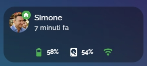
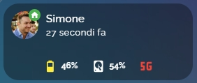

<h2><strong>🧑🏻 ha_person_card card for home assistant</strong></h2>

Volevo condividere una scheda che ho creato con l'aiuto delle varie community per visualizzare le informazioni di una persona tramite l'utilizzo dell'app HA companion.

Istruzioni:

da Hacs, installare:
1. stack-in-card
2. mushroom

poi ...
1. nel file HA sensor.yaml, inserire il contenuto di person_card_lite_sensor.yaml, se non si dispone del file sensor.yaml è necessario creare sensor.yaml nella cartella config/, aprire il file configuration.yaml e inserire questa riga: sensor: !include sensor.yaml
2. sul vostro smartphone installare l'app Home Assistant companion
3. dall'app andate in impostazioni, app complementare, gestione sensori
4. abilitate tutti i sensori che servono e che trovare nei vari file di configurazioni: sensori di rete, sensori batteria, sensori di archiviazione, sensori di posizione.
5. in HA create una card manuale e incollate il contenuto del file: person_card_lite.yaml
6. all'interno del codice della card e del codice inserito nel sensor.yaml, dovete andare a sostituire tutti i miei sensori chiamati simone, con i vostri appena abilitati

<strong>Alla fine ci troveremo ad avere:</strong> 
1. Persona con simbolo se è in casa o no, nome, ultimo aggiornamento dei dati (quindi nascosto la zona dove si trova, fa capire SOLO se è in casa o non in casa), se si vuole vedere invece la ZONA, basta modificare questo nella card: da secondary_info: last-updated a secondary_info: state.
2. % batteria con cambio colore in base al livello, % memoria libera interna dello smartphone, tipo di rete (se è wifi o 5G)

Risultato finale:

Enjoy!

---

## ☕ Vuoi darmi una mano?

Il contenuto di questa pagina è completamente gratuito e lo scopo non è certamente fare soldi. Se vuoi darmi una mano per le spese e il tempo perso, ecco alcuni modi:

| | |
|---|---|
|  | Offrimi un caffè su Ko-fi |
|  | Una donazione libera su PayPal |
|  | Fai i tuoi acquisti Amazon partendo da questo link |

**Canali Telegram:**

| | |
|---|---|
|  | Notizie dedicate a Home Assistant |
|  | Offerte sui prodotti di domotica |

---

Sviluppato e curato da [Simonz82](https://t.me/Simonz82) · © 2026
